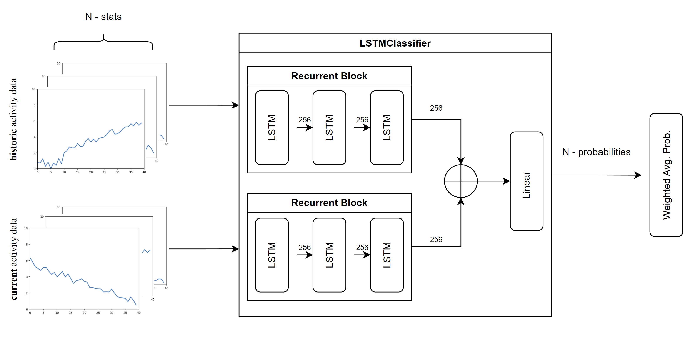
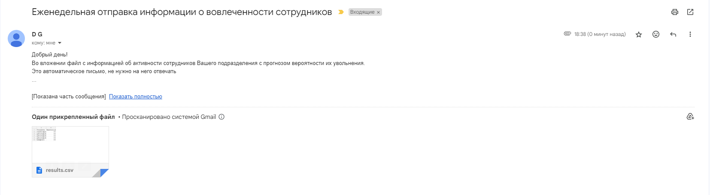

## Сервис прогнозирования увольнения на основе вовлеченности сотрудника

Решение команды: **Peach2Win МИСИС**

### [Ссылка на прототип](https://misis1.ru/)

### Описание решения

Наше решение является сервисам, который позволит руководителям отслеживать вовлеченность сотрудников, а также прогнозировать их увольнение.

Сервис состоит из нескольких компонентов:

**EventsPublisher**

Данный сервис позволяет собирать активность пользователей за их рабочими компьютерами. Сервис подписывается на события операционной системы и отправляет эти события в **Kafka**. Сервис позволяет узнать в какие временный интервалы сотрудник был более активен, а также какими приложениями пользовался больше всего по ходу рабочего дня.

Данные сервис должен быть установлен на рабочий компьютеры сотрудников и работать там в фоновом режиме. Стоит отметить что данные сервис является легковесным и для его работы не требуется много ресурсов.

**EventsSubscriber**

Сервис подписывается на очередь из **Kafka** и сохраняет полученные события в базу данных **Postgresql**

**Analyzer**



Фоновый сервис, который раз в неделю получает статистику активности сотрудников за последнюю неделю через exhange Api. Дополнительно к этой статистике мы добавляем оценку тональности отправленных сотрудником сообщений и добавляем информацию об активности пользователя из **Postgresql**.

Полученные данные (статистика exchange, тональность сообщений, активность на рабочем ПК) передаются в модель, которая оценивает вероятность увольнения сотрудника.

Для того чтобы эффективно обрабатывать два рабочих интервала сотрудника была разработана Сиамская (состоит из двух идентичных нейронных подсетей, в нашем случае Recurrent Block) Модель на основе Рекурентных Нейронных Сетей (SiameseRNNClassifier), которая при прогнозировании увольнения учитывает данные не только за текущий период но и за любой другой из прошлого, а использование padding подхода к временным рядам позвоялет нам использовать интервалы любого размера, к тому же при подсчете финальной оценки используется взвешенное среднее, что позволяет задавать веса для каждой статистики.

Полученные данные сохраняются в базу данных и отправляются на почту руководителю.

Пример сообщения руководителю. В файле содержится email сотрудника и вероятность его увольнения. В случае если данной информации руководителю недостаточно, то он может обратиться к веб-приложению и посмотреть более подробную статистику.



**Веб-приложение**

Сервис позволяет руководителям просматривать информацию о своих сотрудниках. В сервисе можно как просто посмотреть вероятность увольнения, так и посмотреть более подробную информацию об активности. Информация по активность может быть полезна, так как руководитель сможет понять возможные проблемы сотрудника и предложить заблаговременное решение.

### **Инструкция по развертыванию**

Все сервисы, кроме **EventsPublisher** хостятся на севере в docker-контейнерах. Для того чтобы запустить наше решение локально нужно выполнить следующие команды:

Скачать репозиторий:

```powershell
git clone https://github.com/dmdin/EmplObserver.git
```

Перейти в папку с docker-compose:

```powershell
cd EmplObserver/dockerItems
```

Запустить сервисы:

```powershell
docker-compose up -d
```

**NB!**: в файле _nginx/nginx.conf_ указано доменное имя нашего сервера, поэтому при локальном запуске этот сервис выдаст ошибку. Нужно либо заменить доменное имя, либо обращаться напрямую к порту сервиса **front**.

**EventsPublisher**

Сервис хостится на рабочих хостах сотрудников
